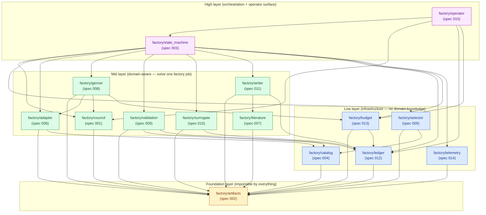
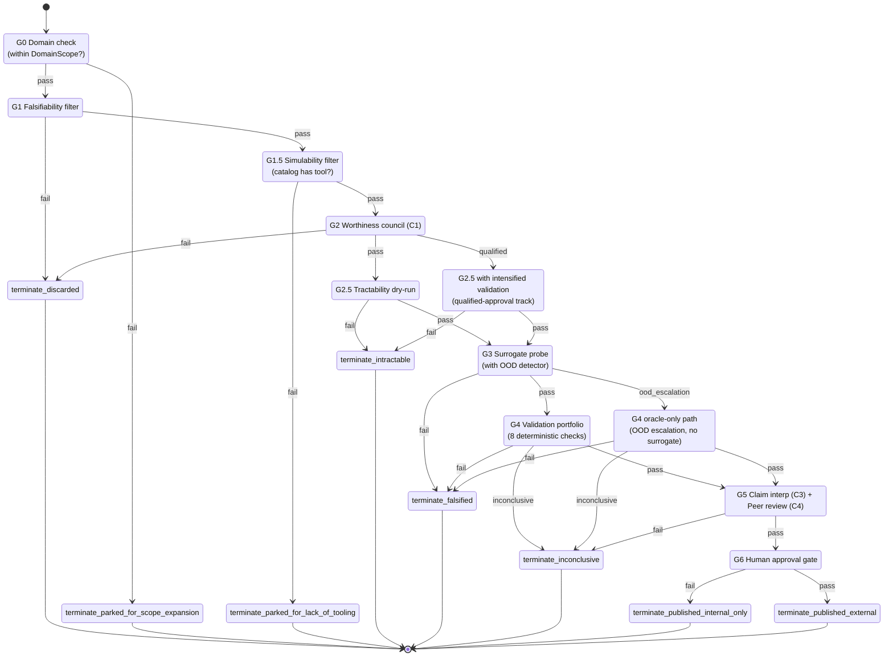
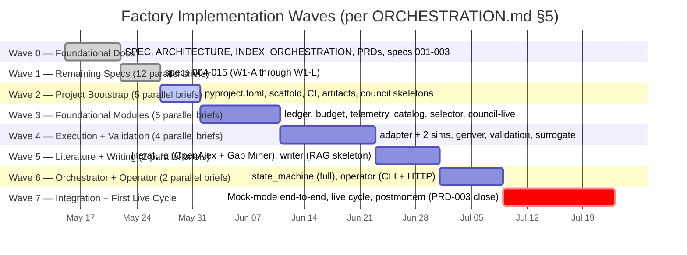

# Diagrams

> Visual companions to `SPEC.md`, `ARCHITECTURE.md`, `INDEX.md`, and `ORCHESTRATION.md`. All Mermaid; rendered by GitHub and most markdown viewers. ASCII trees where Mermaid is not the right medium (filesystem layouts).

This document is **navigation, not narrative**. Every diagram below is a re-projection of authority already encoded elsewhere — the import-linter contract for the module graph, `gate_routes.yaml` for the state machine, `specs/001-council.md` for deliberation, and `ORCHESTRATION.md` §5 for the wave plan. If a diagram drifts from its source of truth, fix the diagram, not the source.

Diagrams are intentionally split into focused pictures rather than a single "everything" mega-diagram. Cramming the dependency graph, the state machine, and the artifact lineage into one chart would be unreadable and would obscure the layered structure that the architecture insists on.

The eight diagrams are:

1. Module Dependency Graph (`graph TD`, layered subgraphs)
2. Gate State Machine (`stateDiagram-v2`, G0..G6 + terminals)
3. Council Deliberation Protocol (`sequenceDiagram`, three-stage)
4. Artifact Lineage (`graph LR`, cycle-scoped)
5. Wave Execution Plan (`gantt`)
6. Per-Cycle Directory Layout (ASCII tree)
7. Onboarding Ramp (`flowchart LR`)
8. Validation Portfolio (G4) (`flowchart TD`, 8 checks + reweighting branch)

---

## 1. Module Dependency Graph

**Caption.** Layered import graph for the `factory/` package, with one node per module and its owning spec number. Edges follow the import-linter contract that will be encoded in `pyproject.toml`. Layers are stacked top-to-bottom in classical architecture style: foundation (typed artifacts) at the top, infrastructure modules in the low layer, domain-aware modules in the middle layer, and orchestration / operator interface at the bottom. Arrows point in the direction of imports — a node imports what it points to.



**Interpretation.** The graph is a strict DAG with **four layers** and zero upward edges. `artifacts` (spec 002) is the universal foundation — every module imports from it, nothing imports from anything else first. The `state_machine` is the **only orchestrator**: it imports from every mid- and low-layer module but is never imported by them, exactly matching `SPEC.md` §3.1 and the "state machine is the only orchestrator" rule in `ARCHITECTURE.md` §3.2. `operator` (spec 015) sits above `state_machine` because it exposes CLI + HTTP surfaces and is allowed to read directly from data modules (`ledger`, `budget`) without going through the state machine. Import-linter in `pyproject.toml` will pin these layers; any PR that introduces a back-edge (e.g., `council` importing `state_machine`) will fail CI.

---

## 2. Gate State Machine

**Caption.** The full G0 → G6 cycle, including every terminal state listed in `specs/003-state-machine.md` §4.1. States are the gates themselves; transitions are the gate outcomes (`pass`, `fail`, `qualified`, `ood_escalation`, `inconclusive`) from `gate_routes.yaml`. Terminal states use the literal names from the YAML so a fresh agent can grep from diagram → config without translation. The `qualified` route from G2 lands on the intensified-validation path; the `ood_escalation` route from G3 bypasses surrogate trust and jumps directly to oracle-only G4.



**Interpretation.** The diagram makes explicit what `gate_routes.yaml` encodes as a flat dictionary: every gate has at most one `pass` edge forward, and every other outcome routes to either an alternative gate (qualified, ood_escalation) or a terminal state. There is **no generic retry** — failures are routed, not retried. Negative results are first-class outputs (`terminate_falsified`, `terminate_inconclusive`, `terminate_intractable`) and each produces an `EvidenceLedger` entry, satisfying `SPEC.md` §1 principle 7. Two terminal states correspond to publication: `terminate_published_internal_only` is the default outcome for cycles that pass G5 but are not externally approved at G6; `terminate_published_external` requires the human gate to fire `pass`. The route table is validated at startup as a DAG — any cycle (e.g., a misconfigured `G4 → G3` retry edge) raises `RouteCycleDetected` and refuses to start (`specs/003-state-machine.md` §6).

---

## 3. Council Deliberation Protocol

**Caption.** Three-stage deliberation as defined in `SPEC.md` §3.2: **First Opinions** (each persona-distinct call answers in parallel), **Anonymized Cross-Review** (each call critiques the others' outputs with identity stripped), and **Chairman Synthesis** (one chairman-persona call writes the `CouncilVerdict` with preserved dissent). The sequence diagram shows the State Machine or Operator triggering a council session, the council orchestrating 4 vendor-distinct calls via OpenRouter, and a Chairman returning a `CouncilVerdict` artifact whose minority views are preserved by construction. **All four calls go through OpenRouter (`https://openrouter.ai/api/v1`), one per vendor; diversity comes from two orthogonal axes — vendor heterogeneity (primary defense) and persona heterogeneity (orthogonal reinforcement). See `FIX_PLAN.md §25` (§25 SUPERSEDES §24).**

```mermaid
sequenceDiagram
    autonumber
    participant SM as State Machine / Operator
    participant CO as factory.council<br/>(spec 001)
    participant M1 as openai/gpt-5.5 · Visionary<br/>(via OpenRouter)
    participant M2 as anthropic/claude-opus-4.7 · Pessimist<br/>(via OpenRouter)
    participant M3 as google/gemini-3.1-pro-preview · Pessimist<br/>(via OpenRouter)
    participant M4 as x-ai/grok-4.3 · Pragmatist<br/>(via OpenRouter)
    participant CH as Chairman<br/>(persona-rotated per session)

    Note over SM,CH: Trigger: gate G2/G5/etc. or C5 scheduler tick
    SM->>CO: deliberate(question, council_id, candidate)
    CO->>CO: assign personas to 4 vendors, pick chairman-persona (rotation)

    rect rgb(243, 244, 255)
    Note over CO,M4: Stage 1 — First Opinions (parallel; independent chat.completions.create calls)
    par parallel
        CO->>M1: chat.completions.create(model=openai/gpt-5.5, system=Visionary, user=question)
        M1-->>CO: opinion_1
    and
        CO->>M2: chat.completions.create(model=anthropic/claude-opus-4.7, system=Pessimist, user=question)
        M2-->>CO: opinion_2
    and
        CO->>M3: chat.completions.create(model=google/gemini-3.1-pro-preview, system=Pessimist, user=question)
        M3-->>CO: opinion_3
    and
        CO->>M4: chat.completions.create(model=x-ai/grok-4.3, system=Pragmatist, user=question)
        M4-->>CO: opinion_4
    end
    end

    rect rgb(254, 249, 195)
    Note over CO,M4: Stage 2 — Anonymized Cross-Review
    CO->>CO: strip call identity from {opinion_1..4}; map to Voice A/B/C/D
    par parallel
        CO->>M1: critique(anonymized opinions)
        M1-->>CO: ranking + critiques_1
    and
        CO->>M2: critique(anonymized opinions)
        M2-->>CO: ranking + critiques_2
    and
        CO->>M3: critique(anonymized opinions)
        M3-->>CO: ranking + critiques_3
    and
        CO->>M4: critique(anonymized opinions)
        M4-->>CO: ranking + critiques_4
    end
    end

    rect rgb(220, 252, 231)
    Note over CO,CH: Stage 3 — Chairman Synthesis (dissent preserved)
    CO->>CH: synthesize(opinions, critiques, rankings)
    CH-->>CO: CouncilVerdict<br/>{majority_view, preserved_dissents[],<br/>chairman_decision, model_lineup, persona_assignment}
    end

    CO-->>SM: CouncilVerdict (artifact hash persisted)
    Note over SM: State Machine routes by chairman_decision +<br/>flags qualified-approval if substantive dissent
```

**Interpretation.** The three coloured bands (blue, yellow, green) match the three protocol stages. **Multi-vendor lineup:** every call is a fresh `chat.completions.create` invocation against OpenRouter (`https://openrouter.ai/api/v1`) with a vendor-prefixed model ID from `FIX_PLAN.md §25.3`. **Two diversity axes (restored):** (a) **vendor heterogeneity** — 4 distinct frontier providers (`openai`, `anthropic`, `google`, `x-ai`) — is the **primary** sycophancy defense; (b) **persona heterogeneity** (Visionary / Pessimist / Pragmatist) is the **orthogonal** reinforcement. Persona-to-vendor assignment can rotate per cycle but the 4 vendors are fixed; a failure of any single vendor raises `CouncilError` (no silent substitution — vendor heterogeneity IS the defense). **Stage 1 parallelism** is critical for two reasons: it minimizes wall-clock for the deliberation and, more importantly, it prevents earlier opinions from anchoring later ones — the "groupthink" failure mode in `SPEC.md` §10 #1. Calls share no chat history and no cache key. **Stage 2 anonymization** is what makes adversarial critique honest; identity-stripping the prompts to Voice A/B/C/D is mandatory, not optional. **Stage 3 chairman synthesis** outputs a `CouncilVerdict` with `preserved_dissents[]` as a first-class field (each `DissentEntry` carries its own `rationale`; there is no separate top-level `dissent_rationales[]` field — see `SPEC.md` §2 and `GLOSSARY.md`). A scalar Go/No-Go output is explicitly forbidden — the state machine consumes both `chairman_decision` and `preserved_dissents` and uses substantive dissent to route to the qualified-approval track shown in diagram 2. With multi-vendor restored, the `CouncilSycophancyDetected` threshold returns to **0.85** and calibration disagreement-rate requirement returns to **≥ 0.40** (`FIX_PLAN.md §25.4`; §25 SUPERSEDES §24).

---

## 4. Artifact Lineage

```mermaid
graph LR
    classDef artifact fill:#e0f2fe,stroke:#0369a1,color:#0c4a6e
    classDef council fill:#fef3c7,stroke:#a16207,color:#713f12
    classDef gate fill:#dcfce7,stroke:#15803d,color:#14532d
    classDef terminal fill:#fee2e2,stroke:#b91c1c,color:#7f1d1d

    GC["GapCandidate<br/>(literature mining)"]:::artifact
    HS["HypothesisSpec<br/>(falsifiable if/then)"]:::artifact
    C1V["CouncilVerdict — C1<br/>(worthiness)"]:::council
    ES["ExperimentSpec<br/>(simulator + control + ladder)"]:::artifact
    C2V["CouncilVerdict — C2<br/>(experimental design)"]:::council
    DRY["G2.5 dry-run result<br/>(tractability)"]:::gate
    SP["SurrogateProbeResult<br/>(G3, with OOD flag)"]:::gate
    VR["ValidationResult<br/>(G4 portfolio outcome)"]:::gate
    C3V["CouncilVerdict — C3<br/>(claim interpretation)"]:::council
    C4V["CouncilVerdict — C4<br/>(peer review)"]:::council
    RR["RunReport<br/>(LaTeX + figures + BibTeX)"]:::artifact
    LE["EvidenceLedgerEntry<br/>(passed/falsified/intractable/inconclusive)"]:::terminal

    GC -->|G0 domain check, G1 falsifiability| HS
    HS -->|G1.5 simulability via SimulatorSelector| HS
    HS -->|G2 Worthiness council| C1V
    C1V -->|design refinement after C1| ES
    ES -->|C2 Experimental Design council| C2V
    C2V -->|G2.5 tractability one-iter dry-run| DRY
    DRY -->|G3 surrogate probe + OOD detector| SP
    SP -->|G4 validation portfolio executes| VR
    VR -->|C3 Claim Interpretation| C3V
    C3V -->|writer drafts RunReport| RR
    RR -->|C4 Peer Review of draft| C4V
    C4V -->|G5 publication-internal; G6 if external| LE
```

**Caption.** Single-cycle chain showing how the eight typed artifacts (`SPEC.md` §2) flow through the gate sequence. Each box is a persisted, content-hashed artifact written to `runs/<cycle-id>/artifacts/`. Each arrow is annotated with the gate or council that produces the transition. The chain is one-way; rejection at any gate routes to an `EvidenceLedgerEntry` with the appropriate `result` field and ends the cycle.



**Interpretation.** The lineage is **forward-only**: no artifact is mutated after creation, only consumed to produce the next. Every transition is annotated with both a gate identifier (`G0`–`G6`) and, where applicable, the council (`C1`–`C4`) that produced the judgment artifact. Provenance hashing — required by `ARCHITECTURE.md` §1.8 — means each artifact carries SHA-256 references to its parents, so a downstream audit (e.g., re-litigating a passed hypothesis when a simulator updates) can walk the chain back from `EvidenceLedgerEntry` to original `GapCandidate` without ambiguity. C5 (Program Direction) is intentionally absent from this diagram — it operates on the *Ledger*, not on per-cycle artifacts, and runs on a weekly cadence orthogonal to any single cycle.

---

## 5. Wave Execution Plan

**Caption.** Project lifecycle wave plan from `ORCHESTRATION.md` §5, rendered as a Gantt chart. Wave 0 (foundational docs, written by the orchestrator directly) and Wave 1 (parallel spec authoring) are marked as `done`. Waves 2–7 are pending and follow the dependency order: bootstrap → foundational modules → execution+validation → literature+writing → orchestrator+operator → integration. Wave durations are notional sprints; the orchestrator may compress or expand based on observed throughput.



**Interpretation.** The wave plan is the orchestrator's master schedule. Each wave gates the next via the verification step listed in `ORCHESTRATION.md` §9 (mypy strict, ruff, mock-mode tests, import-linter). Wave 7 is the only **non-parallel** wave — it is the milestone gate where the orchestrator drives the integration test, runs the first live cycle, and conducts the postmortem that closes PRD-003. The "first runnable artifact" insight from `INDEX.md` §1 — Council-as-library — appears in Wave 3 as W3-F; everything from Wave 4 onwards consumes it. If a subagent fails inside a wave, the orchestrator re-dispatches only that brief (`ORCHESTRATION.md` §4) without rolling back the wave; this keeps wall-clock close to the slowest brief rather than the sum.

---

## 6. Per-Cycle Directory Layout

**Caption.** ASCII tree (not Mermaid — file trees are inherently better as text) showing what `runs/<cycle-id>/` contains after a complete cycle. The layout is mandated by `ARCHITECTURE.md` §1.4 and `specs/003-state-machine.md` §4.3: every artifact, council transcript, and sandbox iteration is colocated under one directory, hash-indexed, so `factory inspect <cycle-id>` can reconstruct the cycle without any other database.

```
runs/<cycle-id>/
├── MANIFEST.json                       Index: cycle metadata, artifact hashes, gate sequence,
│                                       terminal outcome, environment hash, container SHA,
│                                       council lineup, simulator versions. Single-file truth.
│
├── cycle.jsonl                         Append-only event log. One JSON line per event:
│                                       {ts, cycle_id, module, level, event, payload}.
│                                       Filter by `module=state_machine` for gate transitions,
│                                       by `module=council` for deliberation events.
│
├── artifacts/                          Every persisted typed artifact (spec 002).
│   ├── INDEX.json                      Hash → type lookup (e.g., 7a3b2c1 → HypothesisSpec).
│   ├── 7a3b2c1.json                    A GapCandidate emitted at G0.
│   ├── 9f1e8d2.json                    A HypothesisSpec emitted after G1.
│   ├── bc04a73.json                    An ExperimentSpec emitted after C2.
│   ├── e22f1a0.json                    A SurrogateProbeResult emitted at G3.
│   ├── a4c9b18.json                    A ValidationResult emitted at G4.
│   ├── d770e6f.json                    A RunReport emitted at G5.
│   └── ...                             One file per CouncilVerdict, intermediate, etc.
│
├── councils/                           Council session transcripts (spec 001).
│   ├── INDEX.json                      session_id → council_id lookup (C1, C2, C3, C4).
│   ├── c1_2026-05-23T14-22-01.jsonl    First Opinions + Cross-Review + Synthesis log for C1.
│   ├── c2_2026-05-23T14-45-30.jsonl    Same for C2 (Experimental Design council).
│   ├── c3_2026-05-23T18-02-11.jsonl    Same for C3 (Claim Interpretation council).
│   └── c4_2026-05-23T18-18-47.jsonl    Same for C4 (Peer Review council).
│
└── sandbox/                            Generator-verifier sandbox outputs per iteration (spec 008).
    ├── 001/                            Iteration 1.
    │   ├── proposed_code.py            Code-gen agent's proposal.
    │   ├── execution_log.txt           Sandbox stdout / stderr / exit code.
    │   ├── traceback.txt               If runtime error occurred.
    │   └── verifier_report.json        Pass/fail per check, with traces.
    ├── 002/                            Iteration 2 (if Iteration 1 had errors).
    │   └── ...
    └── 010/                            Up to iteration_cap (default 10) from Budget artifact.
```

**Interpretation.** The directory is **self-contained replay material**. `factory inspect <cycle-id>` reads `MANIFEST.json` to get the gate sequence, then walks `artifacts/` and `councils/` to reconstruct every state transition without external DB access. `cycle.jsonl` is append-only so concurrent writes from telemetry don't corrupt history. `sandbox/<NNN>/` directories are bounded by `iteration_cap` from the `Budget` artifact (default 10 per `SPEC.md` §7); when the cap is hit, the cycle terminates as `intractable` and the `sandbox/` directory contains the full diagnostic trail of why generation failed. Everything below `runs/` is gitignored — these are *outputs*, not source. The artifact hash filenames double as deduplication: re-running an identical cycle (same seed, same env) produces the same hashes and overwrites cleanly.

---

## 7. Onboarding Ramp

**Caption.** The 40-minute path from a fresh-context agent (human or LLM) opening the repo to making a green-tested edit. The diagram makes explicit the time budget per step that `ARCHITECTURE.md` §1.10 and `INDEX.md` §0 promise. If any single step takes longer than its allotted time, the spec is missing context and should be patched, per `ARCHITECTURE.md` §6 anti-patterns.

```mermaid
flowchart LR
    classDef fresh fill:#fef3c7,stroke:#b45309,color:#78350f
    classDef read fill:#dbeafe,stroke:#1d4ed8,color:#1e3a8a
    classDef run fill:#dcfce7,stroke:#15803d,color:#14532d
    classDef edit fill:#fae8ff,stroke:#a21caf,color:#581c87
    classDef done fill:#bbf7d0,stroke:#166534,color:#14532d

    FA["Fresh agent<br/>opens repo"]:::fresh
    INDEX["docs/INDEX.md<br/>§1 Orientation +<br/>§4 Top-Level TODO<br/>(5 min)"]:::read
    ARCH["docs/ARCHITECTURE.md<br/>§1 Invariants +<br/>§3 Repo Layout<br/>(10 min)"]:::read
    SPEC["target spec<br/>docs/specs/NNN-*.md<br/>CONTEXT + ENTRY POINTS +<br/>LOCAL DEBUG + DEPENDENCIES<br/>(15 min)"]:::read
    MOCK["mock-mode run<br/>python -m factory.&lt;mod&gt; --mock-mode<br/>(5 min)"]:::run
    TEST["open<br/>tests/test_&lt;mod&gt;_typical_usage.py<br/>copy the pattern<br/>(5 min)"]:::read
    EDIT["smallest possible edit<br/>+ pytest -m 'not live'<br/>(remaining time)"]:::edit
    GREEN["green test<br/>+ structured event<br/>in cycle.jsonl"]:::done

    FA --> INDEX
    INDEX --> ARCH
    ARCH --> SPEC
    SPEC --> MOCK
    MOCK --> TEST
    TEST --> EDIT
    EDIT --> GREEN

    GREEN -.-> CONTRIB["commit + PR<br/>(no need to read more)"]:::done
```



**Interpretation.** The ramp is **strictly sequential** but deliberately short. Each step has a fixed budget: 5 + 10 + 15 + 5 + 5 + 25 ≈ 65 minutes including the green-test step, comfortably under the 60-minute promise for an LLM working at modest speed. The crucial property: a fresh agent should **never read more than four files** to make a productive edit (INDEX + ARCHITECTURE + one spec + one test). If they do, that is a signal in `ARCHITECTURE.md` §6 to file a doc bug and fix the spec, not absorb the gap as tribal knowledge. The dotted edge to "commit + PR" emphasizes that once the green test passes, the agent has everything needed to ship — no separate "context call" with a senior is required by design.

---

## 8. Validation Portfolio (G4)

**Caption.** The eight deterministic checks that constitute the G4 validation gate, from `SPEC.md` §4 and `specs/009-validation-portfolio.md`. Each check fires independently against the candidate `ExperimentSpec` outputs; **all must pass for G4 to pass**. The diagram shows the cross-simulator check as conditional (only fires when the Catalog has ≥2 simulators for the observable), and shows the reweighting branch that fires when the cross-simulator check is unavailable — in that case the remaining checks are weighted heavier on refinement and symmetry as `SPEC.md` §4 G4 mandates.

```mermaid
flowchart TD
    classDef check fill:#dbeafe,stroke:#1d4ed8,color:#1e3a8a
    classDef conditional fill:#fef3c7,stroke:#a16207,color:#713f12
    classDef gate fill:#dcfce7,stroke:#15803d,color:#14532d
    classDef terminal_pass fill:#bbf7d0,stroke:#166534,color:#14532d
    classDef terminal_fail fill:#fecaca,stroke:#b91c1c,color:#7f1d1d
    classDef router fill:#fae8ff,stroke:#a21caf,color:#581c87

    INPUT["G3 SurrogateProbeResult<br/>+ ExperimentSpec<br/>(enters G4)"]:::gate

    INPUT --> CONS["Conservation /<br/>physics invariants<br/>(energy, mass, div B,<br/>momentum residuals)"]:::check
    INPUT --> CONV["Numerical convergence<br/>(residual norm<br/>below pre-registered tol)"]:::check
    INPUT --> REFI["Refinement convergence<br/>(grid / mesh refinement,<br/>Richardson where applicable)"]:::check
    INPUT --> SYMM["Symmetry tests<br/>(held out from<br/>code-gen visibility)"]:::check
    INPUT --> LIMI["Limiting-case tests<br/>(axisymmetric limit,<br/>Newtonian limit, etc.)"]:::check
    INPUT --> STAT["Statistical validity<br/>(per-seed variance,<br/>error bars, no cherry-pick)"]:::check
    INPUT --> PROV["Provenance hashing<br/>(env, code, input, seed,<br/>sim ver, container SHA)"]:::check

    INPUT --> XSIM_DECIDE{"Catalog has &ge;2<br/>simulators for this<br/>observable?"}:::router
    XSIM_DECIDE -->|yes| XSIM["Cross-simulator check<br/>(independent re-run on<br/>second simulator)"]:::check
    XSIM_DECIDE -->|no| REWEIGHT["Reweighting branch:<br/>weight refinement +<br/>symmetry checks heavier"]:::conditional
    REWEIGHT --> REFI
    REWEIGHT --> SYMM

    CONS --> GATE_ALL{"All required<br/>checks PASS?"}:::router
    CONV --> GATE_ALL
    REFI --> GATE_ALL
    SYMM --> GATE_ALL
    LIMI --> GATE_ALL
    STAT --> GATE_ALL
    PROV --> GATE_ALL
    XSIM --> GATE_ALL

    GATE_ALL -->|yes| G4_PASS["G4 PASS<br/>route to G5"]:::terminal_pass
    GATE_ALL -->|no, hard failure| G4_FAIL["G4 FAIL<br/>route to terminate_falsified"]:::terminal_fail
    GATE_ALL -->|inconclusive<br/>(e.g., insufficient seeds)| G4_INCONC["G4 INCONCLUSIVE<br/>route to terminate_inconclusive"]:::terminal_fail
```

**Interpretation.** The portfolio is **wide on purpose**. Numerical correctness alone is insufficient against adversarial code-gen (`SPEC.md` §10 #2, #3): a clever generator can satisfy any single check while failing the others, so the gate requires the AND of every applicable check. The cross-simulator branch is the strongest defense against invariant hacking — if two independently-developed simulators agree on the observable, the result is robust — but most physics observables are not cross-simulator-validatable today (`SPEC.md` §13). When the Catalog cannot provide the orthogonal check, the reweighting branch makes the held-out symmetry and refinement checks heavier in scoring, preserving the gate's authority. Councils explicitly **never** vote on any G4 check (`SPEC.md` §3.4) — these are deterministic numerical decisions, and a council voting on whether `divB = 0` would be "expensive hallucination by quorum." The three terminal outcomes (PASS, FAIL, INCONCLUSIVE) match the routes in `gate_routes.yaml` G4 entry in `specs/003-state-machine.md` §4.1.

---

## Appendix A — Diagram Maintenance

These diagrams are derived views, not sources of truth. They must be regenerated whenever the underlying source changes:

| Diagram | Source of truth | Triggers an update when... |
| :--- | :--- | :--- |
| 1. Module Dependency Graph | `pyproject.toml` import-linter config | A new module is added or a layer rule changes. |
| 2. Gate State Machine | `config/gate_routes.yaml` | A route is added, removed, or rerouted. |
| 3. Council Deliberation | `specs/001-council.md` | Persona set, model lineup, or stage protocol changes. |
| 4. Artifact Lineage | `specs/002-artifacts.md` + state machine | A new artifact type is added to the chain. |
| 5. Wave Execution Plan | `ORCHESTRATION.md` §5 | Wave structure changes or a wave completes. |
| 6. Per-Cycle Directory Layout | `specs/003-state-machine.md` §4.3 | Cycle directory schema changes. |
| 7. Onboarding Ramp | `ARCHITECTURE.md` §1.10 | Step budgets or step contents change. |
| 8. Validation Portfolio (G4) | `specs/009-validation-portfolio.md` | A check is added or removed from the portfolio. |

The orchestrator owns this file. If a subagent's brief changes any of the sources above, the orchestrator's verification step must include refreshing the corresponding diagram in this document before advancing the wave.

---

## Appendix B — Mermaid Rendering Notes

All diagrams in this file are valid Mermaid syntax compatible with:

- GitHub's built-in markdown rendering (mermaid-cli pinned by the repo's `.github/workflows/`).
- VS Code with the "Markdown Preview Mermaid Support" extension.
- Mermaid Live Editor (https://mermaid.live) for ad-hoc edits.

Validity checks performed:

1. Every node referenced in an edge is declared.
2. Every subgraph is closed with `end`.
3. No reserved keywords (`graph`, `flowchart`, `subgraph`, `end`) used as bare node IDs.
4. `stateDiagram-v2` directive is explicit (v2 syntax differs from v1 around composite states).
5. `sequenceDiagram` uses `autonumber` for traceability and `rect rgb(...)` blocks for the three protocol stages.
6. `gantt` uses ISO `dateFormat YYYY-MM-DD`.

If a diagram fails to render, the most likely cause is a missing `end` on a `subgraph` or a stray `:`. Always render Diagram 1 (the biggest, most edge-dense) first as a smoke test before publishing changes to this file.

---

## Appendix C — Things Intentionally Not Diagrammed

To keep this file focused, the following are deliberately **not** included:

- **Internal class structure** of individual modules. That lives in each spec's §3 Public Interface.
- **The Generator-Verifier ReAct turn loop in detail.** That belongs in `specs/008-generator-verifier.md`. A high-level box ("genver" in Diagram 1) is sufficient at this level.
- **OpenAlex graph traversal internals.** Covered by `specs/007-literature-discovery.md`. The Gap Miner appears here only as the producer of `GapCandidate` in Diagram 4.
- **C5 program-direction council.** It is intentionally orthogonal to per-cycle flow (weekly cadence) and lives in its own scheduler. Adding it to Diagram 4 would conflate cycle-scoped artifacts with program-scoped governance.
- **Persistence layer of the EvidenceLedger.** The DB schema lives in `specs/012-evidence-ledger.md`; this file shows the Ledger only as a terminal artifact in Diagram 4 and a foundation module in Diagram 1.

If a future task requires diagramming any of the above, add a new numbered section to this document with the same caption + diagram + interpretation structure; do not retrofit existing diagrams.
